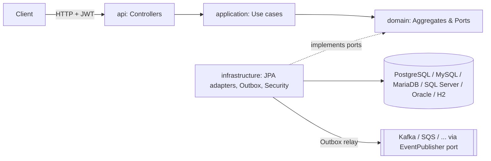

# OMS Service — Enterprise Spring Boot Reference (Java 21 · Spring Boot 4.1)

ตัวอย่างระบบ **Order Management System (OMS)** สำหรับธุรกิจค้าปลีก/อีคอมเมิร์ซ ที่ออกแบบตาม best practice
ซึ่งองค์กรระดับโลกใช้กันจริง และมี **database layer ที่ vendor-neutral** — โค้ดชุดเดียวรันได้ทั้ง
PostgreSQL, MySQL, MariaDB, Microsoft SQL Server, Oracle และ H2 โดยไม่ต้องแก้ Java แม้แต่บรรทัดเดียว
เพียงเปลี่ยน profile / JDBC URL

| | |
|---|---|
| Runtime | Java 21 (virtual threads), Spring Boot 4.1.1, Spring Framework 7, Hibernate 7, Flyway 12, HikariCP |
| Business | Customer · Catalog (Product) · Inventory (stock reservation) · Ordering (order lifecycle) |
| Databases | PostgreSQL · MySQL · MariaDB · SQL Server · Oracle · H2 (local/test) |
| Build | `./mvnw verify` → unit tests + ArchUnit + H2 integration + Testcontainers vendor contract tests |

---

## 1. ทำไมถึงเลือกธุรกิจ "Order Management"

การรับออร์เดอร์คือ workload ที่ทุก enterprise ระดับโลก (Amazon, Shopify, Zalando, Lazada ฯลฯ) ต้องเจอ
และมันบังคับให้ต้องแก้ปัญหาที่ยากจริง ๆ ครบทุกข้อ:

| ปัญหาที่พบในโลกจริง | วิธีที่ project นี้แก้ |
|---|---|
| ลูกค้ากด "สั่งซื้อ" ซ้ำเพราะเน็ตหลุด → ได้ 2 ออร์เดอร์ | **Idempotency-Key** (แบบ Stripe) — key เดิม + payload เดิม = ตอบ response เดิม ไม่ execute ซ้ำ |
| ของชิ้นสุดท้ายถูกจอง 2 คนพร้อมกัน (race condition) | **Optimistic locking** (`@Version`) บน InventoryItem + auto-retry ทั้ง transaction |
| บันทึกออร์เดอร์สำเร็จ แต่ส่ง event ไป Kafka ไม่สำเร็จ (dual-write) | **Transactional Outbox** — event ถูกเขียนใน transaction เดียวกับออร์เดอร์ แล้วมี relay ส่งต่อ |
| ราคาสินค้าเปลี่ยนแล้วออร์เดอร์เก่าเพี้ยน | **Snapshot** ราคา/ชื่อสินค้าลงใน `order_item` ณ เวลาสั่งซื้อ |
| สถานะออร์เดอร์กระโดดมั่ว (PENDING → DELIVERED) | **State machine** ใน aggregate `Order` — กฎอยู่ที่ domain ไม่ใช่ controller |
| ต้องรองรับลูกค้าองค์กรที่ใช้ DB คนละค่าย | **Vendor-neutral persistence layer** (ดูข้อ 4) |

---

## 2. สถาปัตยกรรม: Hexagonal / Clean Architecture + DDD (modular monolith)

```
com.enterprise.oms
├── customer/     ┐
├── catalog/      │  แต่ละ bounded context มี 4 ชั้นเหมือนกัน:
├── inventory/    │    domain/          entity, value object, domain event, repository PORT (interface)
├── ordering/     ┘    application/     use case / service, DTO, transaction boundary
│                      infrastructure/  Spring Data JPA ADAPTER, config, wiring
│                      api/             REST controller (thin)
├── shared/
│   ├── domain/          AggregateRoot, AuditableEntity, Money, DomainEvent, UuidV7, exceptions
│   ├── application/     IdempotencyService, OptimisticLockRetry, EventPublisher (port), AppProperties
│   ├── infrastructure/  security (JWT), outbox relay, idempotency store, correlation-id filter, DB vendor info
│   └── api/             GlobalExceptionHandler (RFC 9457 Problem Details), PageResponse
└── bootstrap/           LocalDataSeeder (local profile only)
```



**กฎการพึ่งพา (dependency rule) ถูกบังคับด้วย ArchUnit** (`ArchitectureTest`) — build จะแดงทันทีถ้ามีใคร:
- ให้ `domain` import Spring MVC / Security / Jackson / servlet
- ให้ `application` เรียก `infrastructure` ตรง ๆ (ต้องผ่าน port)
- วาง `@RestController` นอก `api` หรือวาง `JpaRepository` นอก `infrastructure`
- สร้าง cyclic dependency ระหว่าง module (customer / catalog / inventory / ordering / shared)

Module ติดต่อกันผ่าน **application service + read model** เท่านั้น (เช่น `ordering` ใช้ `ProductSnapshot` ไม่แตะ entity `Product`)
และอ้างอิงข้าม aggregate ด้วย **id** ไม่ใช่ JPA relation — ทำให้แยกออกเป็น microservice ได้ภายหลังโดยไม่ต้องรื้อ

---

## 3. จุดเด่นที่นำมาใช้ (สิ่งที่ global players ทำ)

| หมวด | สิ่งที่ทำ | ไฟล์หลัก |
|---|---|---|
| **Idempotent API** | header `Idempotency-Key` → claim / execute / complete / release, จัดการ replay, payload mismatch (422), in-flight (409), TTL cleanup job | `shared/application/IdempotencyService`, `shared/infrastructure/idempotency/*` |
| **Transactional Outbox** | `AggregateRoot.registerEvent()` → Spring Data `@DomainEvents` → บันทึกลง `outbox_event` ใน TX เดียวกัน (`BEFORE_COMMIT`) → `OutboxRelay` poll ด้วย `SKIP LOCKED` → `EventPublisher` port (สลับเป็น Kafka ได้ด้วย property เดียว) | `shared/infrastructure/outbox/*` |
| **Optimistic locking + retry** | `@Version` ในทุก aggregate, `OptimisticLockRetry` ครอบ *นอก* transaction boundary | `shared/domain/AggregateRoot`, `ordering/application/PlaceOrderUseCase` |
| **Rich domain model** | invariants และ state machine อยู่ใน `Order`, `InventoryItem`, `Money` (value object แบบ record) | `ordering/domain/Order`, `inventory/domain/InventoryItem` |
| **Time-ordered IDs** | UUID v7 สร้างฝั่งแอป → aggregate รู้ id ก่อน persist, index ไม่ fragment, ไม่ต้องพึ่ง sequence ของ DB | `shared/domain/UuidV7` |
| **Auditing** | `created_at/updated_at/created_by/updated_by` อัตโนมัติจาก security context + application clock | `shared/domain/AuditableEntity`, `JpaAuditingConfig` |
| **Error contract** | RFC 9457 `application/problem+json` พร้อม `code` ที่คงที่ และ `correlationId` ทุก response; internal error ไม่รั่ว | `shared/api/GlobalExceptionHandler` |
| **Observability** | `X-Correlation-ID` → MDC → log ทุกบรรทัด, `/actuator/health` (liveness/readiness probes), `/actuator/prometheus`, `/actuator/info` แสดง DB vendor/dialect, structured ECS JSON logs ใน `prod` | `CorrelationIdFilter`, `DatabaseVendorInfo`, `application-prod.yml` |
| **Security** | Stateless OAuth2 resource server (JWT), role จาก claim `roles`, URL-level authorization, สลับ IdP ผ่าน `issuer-uri`; `app.security.enabled=false` สำหรับ local | `SecurityConfig` |
| **API hygiene** | versioned path `/api/v1`, Bean Validation, pagination envelope + max page size, OpenAPI/Swagger UI | `*Controller`, `PageResponse`, `OpenApiConfig` |
| **Performance defaults** | HikariCP tuned, JDBC batching + ordering, `default_batch_fetch_size` (กัน N+1), `open-in-view=false`, autocommit off, virtual threads, graceful shutdown | `application.yml` |
| **Testing pyramid** | unit (domain, services w/ Mockito) → ArchUnit → H2 API flow (`OrderFlowIT`, `SecurityIT`) → **vendor contract tests** บน Testcontainers | `src/test` |
| **Delivery** | multi-stage Dockerfile (layered jar, non-root, ZGC, healthcheck), docker-compose ทุก DB, GitHub Actions CI | `Dockerfile`, `docker-compose.yml`, `.github/workflows/ci.yml` |

---

## 4. Database layer ที่เชื่อมได้ทุกค่าย — ออกแบบอย่างไร

หลักคิด: **"Portable by construction, vendor-specific by exception"**

### 4.1 กลไก

1. **JPA/Hibernate เป็น abstraction** — Hibernate ตรวจ dialect จาก JDBC metadata เอง (`H2Dialect`, `PostgreSQLDialect`, `MySQLDialect`, `MariaDBDialect`, `SQLServerDialect`, `OracleDialect`) ไม่ต้อง config
2. **Driver ทุกค่ายอยู่ใน image เดียว** (runtime scope) → image เดียวกัน deploy กับ DB ใดก็ได้ เลือกด้วย `SPRING_PROFILES_ACTIVE` + `DB_URL`
3. **Flyway migration แยกโฟลเดอร์ต่อ vendor** ด้วย placeholder `{vendor}`:
   ```
   db/migration/
     postgresql/V1__init_schema.sql   ← uuid, numeric, boolean, text, partial index
     mysql/V1__init_schema.sql        ← binary(16), decimal, bit, longtext, utf8mb4
     mariadb/V1__init_schema.sql      ← native uuid (10.7+)
     sqlserver/V1__init_schema.sql    ← uniqueidentifier, datetime2(7), varchar(max), filtered index
     oracle/V1__init_schema.sql       ← raw(16), number, timestamp(9), clob
     h2/V1__init_schema.sql
   ```
   DDL คือที่ที่ความต่างของ vendor *ควร* อยู่ (ชนิดข้อมูล, index เฉพาะทาง) — ไม่ใช่ใน Java
4. **Entity mapping เลือก type ที่ทุกค่ายรองรับเหมือนกัน** (นี่คือส่วนที่คนมักพลาด):

   | ประเด็น | ทางเลือกที่ใช้ | เหตุผล |
   |---|---|---|
   | เวลา | `Instant` + `@JdbcTypeCode(TIMESTAMP)` + `hibernate.jdbc.time_zone=UTC` (เก็บ UTC ใน timestamp ธรรมดา) | `timestamptz`/`datetimeoffset` มีพฤติกรรมต่างกันมากระหว่างค่าย; timestamp + UTC เหมือนกันทุกที่ |
   | ความละเอียดเวลา | `Clock` ระดับ microsecond | DB ส่วนใหญ่เก็บได้ 6 หลัก; JVM มี nanos → ค่าจะเพี้ยนหลัง reload ถ้าไม่ตัด |
   | Enum | `@Enumerated(STRING)` + `@JdbcTypeCode(VARCHAR)` | ไม่งั้น Hibernate จะคาดหวัง `ENUM(...)` บน MySQL และ schema validation พัง |
   | ข้อความยาว | `@Column(length = Length.LONG32)` | ได้ `text` / `longtext` / `varchar(max)` / `clob` อัตโนมัติ (ถ้าไม่ระบุ MySQL จะกลายเป็น `tinytext`) |
   | Primary key | UUID v7 assigned ในแอป | ไม่พึ่ง `IDENTITY`/`SEQUENCE` ที่แต่ละค่ายทำต่างกัน และ batch insert ได้ |
   | Boolean | `boolean` | Hibernate map เป็น `boolean` / `bit` / `number(1,0)` ให้เอง |
   | เงิน | `decimal(19,4)` + ISO-4217 | ห้ามใช้ float; scale คงที่ทุกค่าย |
   | ชื่อตาราง | `orders` ไม่ใช่ `order`, `idem_key` ไม่ใช่ `key` | reserved word ต่างกันในแต่ละค่าย |
   | Unicode บน SQL Server | migration ใช้ `nvarchar` และ profile `mssql` ตั้ง `hibernate.use_nationalized_character_data=true` | `varchar` ของ SQL Server ผูกกับ code page ทำให้ภาษาไทยกลายเป็น `?` (vendor contract test จับได้) |
   | Locking | optimistic (`@Version`) เป็นหลัก; `SKIP LOCKED` ผ่าน Hibernate hint (fallback เป็น `FOR UPDATE` บน H2) | ไม่เขียน SQL เฉพาะค่ายในโค้ด |

5. **Schema validation เป็นเกราะ**: profile `local`, `test` และ vendor tests รันด้วย `spring.jpa.hibernate.ddl-auto=validate`
   → ถ้า migration ของค่ายใดไม่ตรงกับ entity mapping, แอป/CI จะ fail ทันทีก่อนถึง production

### 4.2 Vendor contract tests (Testcontainers)

`AbstractVendorContractIT` รัน **flow ธุรกิจเดียวกัน** (migrate → validate → register → create product → place order idempotently
→ confirm → pay → ship → outbox relay) บน container จริงของ **PostgreSQL 17, MySQL 8.4, SQL Server 2022**
(`PostgresVendorIT`, `MySqlVendorIT`, `MsSqlVendorIT`). ต้องมี Docker; ถ้าไม่มีจะ skip อัตโนมัติ (`disabledWithoutDocker`) และรันเต็มใน GitHub Actions
เพิ่มค่ายใหม่ = เพิ่ม subclass 10 บรรทัด

### 4.3 วิธีเพิ่ม vendor ใหม่ (เช่น DB2)

1. เพิ่ม driver + `flyway-database-db2` ใน `pom.xml`
2. สร้าง `db/migration/db2/V1__init_schema.sql` (คัดลอกจาก postgresql แล้วปรับชนิดข้อมูล)
3. สร้าง `application-db2.yml` (แค่ URL/credential)
4. (แนะนำ) เพิ่ม `Db2VendorIT`
ไม่ต้องแตะ Java ใน domain/application เลย

---

## 5. เริ่มใช้งาน

### Local (H2 in-memory, ไม่ต้องมี auth, มีข้อมูลตัวอย่าง)
```bash
./mvnw spring-boot:run            # profile 'local' เป็น default
open http://localhost:8080/swagger-ui.html
open http://localhost:8080/h2-console   # JDBC URL: jdbc:h2:mem:oms  user: sa
curl http://localhost:8080/actuator/info  # ดูว่าเชื่อมกับ DB ค่ายไหน dialect อะไร
```

### PostgreSQL / MySQL / MariaDB / SQL Server (docker-compose)
```bash
docker compose up -d postgres
SPRING_PROFILES_ACTIVE=postgres APP_SECURITY_ENABLED=false ./mvnw spring-boot:run

docker compose --profile mysql up -d mysql
SPRING_PROFILES_ACTIVE=mysql   APP_SECURITY_ENABLED=false ./mvnw spring-boot:run

docker compose --profile mariadb up -d mariadb
SPRING_PROFILES_ACTIVE=mariadb APP_SECURITY_ENABLED=false ./mvnw spring-boot:run

docker compose --profile mssql up -d mssql mssql-init      # mssql-init สร้าง database 'oms'
SPRING_PROFILES_ACTIVE=mssql   APP_SECURITY_ENABLED=false ./mvnw spring-boot:run
```
Oracle: ตั้ง `SPRING_PROFILES_ACTIVE=oracle` และ `DB_URL=jdbc:oracle:thin:@//host:1521/SERVICE` (ใช้ `gvenzl/oracle-free` ได้)

ทุก profile รับ env `DB_URL`, `DB_USERNAME`, `DB_PASSWORD`, `DB_POOL_MAX` — ค่าที่เห็นในไฟล์เป็นแค่ default สำหรับ dev

### Container
```bash
docker compose --profile app up --build      # app + postgres
```

### Security (production)
```yaml
app.security.enabled: true                                   # default
spring.security.oauth2.resourceserver.jwt.issuer-uri: https://login.example.com/realms/oms   # Keycloak / Entra ID / Cognito / Okta
```
- ทุก `/api/**` ต้องมี `Authorization: Bearer <JWT>`
- `POST /api/v1/products/**` → role `ADMIN` หรือ `CATALOG`; `POST /api/v1/inventory/**` → `ADMIN` หรือ `INVENTORY`; `/actuator/**` (ยกเว้น health/info) → `OPS`
- role อ่านจาก claim `roles` (array) และ scope จาก claim `scope`
- dev/test: ตั้ง `APP_SECURITY_JWT_SECRET` (≥ 32 bytes) เพื่อรับ HS256 token ที่เซ็นด้วย shared secret

---

## 6. API เดินเรื่อง (curl)

```bash
BASE=http://localhost:8080/api/v1

CUST=$(curl -s -X POST $BASE/customers -H 'Content-Type: application/json' \
  -d '{"email":"somchai@example.com","fullName":"Somchai Jaidee"}' | jq -r .id)

PROD=$(curl -s -X POST $BASE/products -H 'Content-Type: application/json' \
  -d '{"sku":"TV-55-OLED","name":"55\" OLED TV","price":45900,"currency":"THB","initialStock":3}' | jq -r .id)

# สั่งซื้อ (ส่งซ้ำด้วย key เดิมได้อย่างปลอดภัย)
ORDER=$(curl -s -X POST $BASE/orders -H 'Content-Type: application/json' \
  -H "Idempotency-Key: $(uuidgen)" \
  -d "{\"customerId\":\"$CUST\",\"lines\":[{\"productId\":\"$PROD\",\"quantity\":2}]}" | jq -r .id)

curl -s $BASE/inventory/$PROD | jq          # quantityReserved: 2, available: 1
curl -s -X POST $BASE/orders/$ORDER/confirm | jq .status
curl -s -X POST $BASE/orders/$ORDER/pay     | jq .status
curl -s -X POST $BASE/orders/$ORDER/ship    | jq .status   # stock ออกจากคลังจริง
curl -s $BASE/inventory/$PROD | jq          # quantityOnHand: 1, quantityReserved: 0
```

ตัวอย่าง error (RFC 9457):
```json
{
  "type": "about:blank", "title": "Unprocessable Content", "status": 422,
  "detail": "Insufficient stock for product 01a0...: requested 10, available 1",
  "instance": "/api/v1/orders",
  "code": "INSUFFICIENT_STOCK",
  "correlationId": "5f0c7d2e-…",
  "timestamp": "2026-09-10T03:00:00Z"
}
```

Order lifecycle: `PENDING → CONFIRMED → PAID → SHIPPED → DELIVERED`, ยกเลิกได้จนถึง `PAID` (คืน stock อัตโนมัติ)

---

## 7. ทดสอบ

```bash
./mvnw test                  # unit + ArchUnit (ไม่ต้องมี DB)
./mvnw verify                # + H2 integration tests + vendor contract tests (ต้องมี Docker; ไม่มีจะ skip)
./mvnw verify -Dit.test=PostgresVendorIT   # เฉพาะค่ายเดียว
```
รายงาน coverage: `target/site/jacoco/index.html`

---

## 8. การตัดสินใจเชิงออกแบบที่ควรรู้

- **ไม่ใช้ Lombok / MapStruct** — Java 21 records + explicit code อ่านง่ายกว่าและไม่มี annotation-processor magic (เพิ่มได้ถ้าทีมต้องการ)
- **JPA annotations อยู่บน domain entity** (pragmatic DDD) แทนการแยก persistence model อีกชุด — ลด boilerplate ครึ่งหนึ่ง;
  ArchUnit ยังคงกันไม่ให้ domain รู้จัก Spring MVC/Security
- **Outbox relay รันได้หลาย instance** ด้วย `SKIP LOCKED`; ถ้าต้องการ exactly-once ปลายทาง ให้ consumer dedupe ด้วย `eventId` (payload มีให้แล้ว)
- **Idempotency key ผูกกับ request hash** ไม่ผูกกับ user — ถ้าระบบมีหลาย tenant ให้ prefix key ด้วย tenant/user id ที่ controller
- **`ddl-auto=none` ใน profile ของ vendor จริง** — schema เป็นของ Flyway; ความถูกต้องถูกพิสูจน์ด้วย vendor contract tests (`validate`) ใน CI
- Oracle: migration เขียนสำหรับ 19c/21c (`number(1,0)` สำหรับ boolean); บน 23ai เปลี่ยนเป็น `boolean` ได้
- MariaDB: migration ใช้ native `uuid` (10.7+); เวอร์ชันเก่ากว่านั้นใช้ `binary(16)` แบบ MySQL
